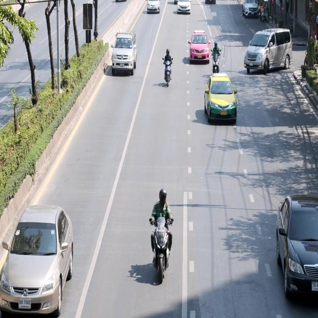
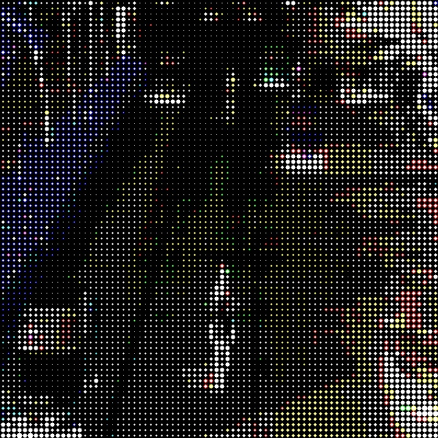

# 🎨 RGB Halftone Image Generator (Python + OpenCV)

This project demonstrates how to create **halftone effects** (similar to print dots) on RGB images using **pure Python, OpenCV, and NumPy**.

---

## 🚀 Features
- Works on **any RGB image**
- Adjustable **dot size (block size)**
- Processes **each color channel separately**
- Generates **halftone artistic effects**
- Simple and pure Python — no deep learning required

---

## 🧩 Installation

1. Clone or unzip this project.
2. Install dependencies:

```bash
pip install opencv-python matplotlib numpy
```

3. Place your image as `input.jpg` in the same folder.

---

## ▶️ Usage

```bash
python halftone_rgb.py
```

The script will:
- Display the original and halftoned images side by side.
- Save the halftoned image as `halftoned_output.jpg`.

---

## ⚙️ Parameters

You can adjust the **block size** for finer or coarser halftone dots:

```python
halftone_rgb("input.jpg", block_size=8)
```

- Smaller `block_size` = finer details
- Larger `block_size` = coarser dots

---

## 📚 Example Output

| Original | Halftoned |
|-----------|------------|
|  |  |

---

## 🧠 About Halftoning

Halftoning simulates continuous-tone images using discrete dots — often used in printing or retro visual effects. This example creates circular dots per pixel block whose size depends on brightness.

---

## 🧑‍💻 Author

Ali Abbas  
[GitHub Profile](https://github.com/aabbas77-web)  
Python + OpenCV | Image Processing | Computer Vision
